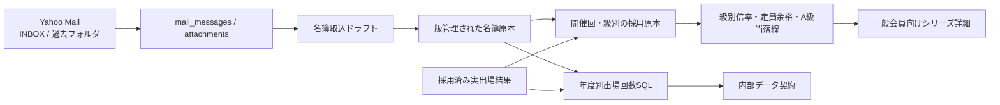

# 大会倍率・A級当落線推移 技術計画

要件定義書: `docs/features/tournament-lottery-trends/requirements.md`

## 1. 方針

- 大会系列・開催回は既存の `tournament_series` / `tournament_series_editions` を正準とする。
- 申込名簿、抽選結果、確定名簿は削除置換せず版管理し、開催回・級ごとに集計へ採用する原本を明示する。
- 年度別出場回数は永続集計値を持たず、採用済みの確定名簿と実出場結果からSQLで都度算定する。件数規模に対して十分軽く、訂正時のキャッシュ無効化漏れを避けられるためである。
- Yahoo Mailの一括処理は「取得」「候補判定」「構造化」「確認・採用」を分離する。候補2,956通を無条件にAIへ投入しない。
- 一般会員向けには集計結果だけを返し、氏名・メール・添付・内部確認情報は返さない。

## 2. データモデル

### 2.1 開催回の大会区分

`tournament_series_editions` に次を追加する。

- `competition_category`: `official | new_year | hosted | supported | other | unknown`。既存行は`unknown`で安全側へ倒す。
- `competition_category_source_mail_id`: 根拠メール。メール以外の一次資料の場合はnullとし、noteへ根拠を残す。
- `competition_category_verified_at` / `verified_by_user_id`: 区分確定の監査情報。

年度別出場数へ入るのは`official`と`new_year`だけとし、`unknown`を推定で含めない。2024年度以降の対象年度は、区分不明開催を完全性不足として報告する。

### 2.2 名簿の版管理

既存 `tournament_entry_rosters` を拡張する。

- 現行の `(event_id, roster_type)` UNIQUEを廃止し、同種名簿を複数版保持できるようにする。
- `source_mail_message_id`を追加し、本文のみの通知と添付削除後もメールを追跡する。
- `supersedes_roster_id`、`superseded_at`、`approved_at`、`approved_by_user_id`を追加する。
- 訂正時は旧名簿を削除せず、旧版をsupersededにして新版を追加する。後日の確定名簿更新は訂正ではないため、別の有効な発表として併存させる。
- 既存行は版1・未supersededとして移行し、現行イベント詳細は最新有効版だけを従来どおり表示する。

`tournament_entry_roster_entries` には次を追加する。

- `selection_outcome`: `accepted | waitlisted | rejected | unknown`。申込名簿は通常`unknown`、抽選結果の当選者は`accepted`とする。
- `selection_exempt`: 主催者枠・抽選除外を示すboolean。
- 同一名簿・級で正規化氏名が重複した場合は自動除外せず、ドラフト検証エラーにする。

確定名簿として数える原本を表す `tournament_confirmed_roster_publications` を新設する。

- `edition_id`, `grade`, `roster_id`, `published_at`を保持する。
- 1つの原本を複数用途で使えるため、「申込名簿を確定名簿とする」と明示された無抽選大会では、同じrosterを確定名簿発表として参照できる。
- 後日の追加確定名簿も複数行で保持し、年度回数は有効な発表の和集合を取る。

### 2.3 開催回・級別の採用原本

`tournament_edition_grade_lottery_facts` を新設し、開催回・級ごとの集計契約を版管理する。

- `edition_id`, `grade`
- `selection_status`: `lottery | under_capacity | no_capacity | unknown`
- `capacity`、`application_start_date`
- `applicant_roster_id`: 申込者数の正となる名簿
- `selection_result_roster_id`: 抽選結果発表時の当落結果原本。抽選時確定者数は`selection_outcome='accepted'`を数える。
- `actual_result_class_id`: 当日実出場者の正となる `tournament_classes` 行
- `selection_rule_version`: A級優先抽選ルールの版。初期値は制度施行期間に応じた `ajka-a-priority-2024-v1`。
- `selection_rule_evidence`: 上記ルール版を確定した一次資料または正典内の根拠キー。ルール適用期間外または根拠を特定できない開催回はnullのままにし、A級当落線をincompleteとする。
- `source_mail_message_id`、`verified_at`、`verified_by_user_id`
- `supersedes_fact_id`、`valid_to`: 訂正前の定員・採用原本・結果リンクを残す。`valid_to IS NULL`の `(edition_id, grade)` を1件に制約する。

整合性はDB CHECKと承認処理の両方で守る。

- `lottery`: 正のcapacity、applicant roster、selection result rosterが必要。
- `under_capacity`: 正のcapacityとapplicant rosterが必要で、申込者数がcapacity未満であることを承認時に検証する。
- `no_capacity`: capacityはnull、applicant rosterが必要。
- 大会全体定員から級別capacityを生成しない。

### 2.4 名簿取込ドラフト

`tournament_roster_import_drafts` を新設する。

- メール本文または添付単位で、原本、パーサ版、抽出payload、失敗理由、推定開催回・名簿種別、状態を保持する。
- 状態は `pending_review | approved | rejected | parse_failed | superseded`。
- 添付ありはattachment単位、本文のみはmessage単位で一意にし、再実行を冪等にする。
- 承認時に版管理されたroster、確定名簿発表、級別採用原本を1トランザクションで作成・更新する。

## 3. 選手・自会員の自動紐づけ

- `normalizePlayerName`を唯一の氏名正規化関数として使う。
- `users.name`を正規化した結果が1会員だけに一致した場合、roster entryの`user_id`と`players.user_id`を自動設定する。
- 一致0件または正規化後に複数会員へ一致する場合はnullのままにし、別情報から推測しない。
- roster取込とresult materializeで同じ共有関数を呼び、既存playersについても一括バックフィルできるようにする。
- 現行のplayersは正規化姓名単位で1行という既知仕様を維持し、所属会や自己申告回数を同定キーへ追加しない。

## 4. 年度別出場回数

`apps/web/src/lib/lottery/appearance-counts.ts` にサーバー専用クエリを置く。

入力:

- `playerIds`または`userIds`
- 協会年度
- 基準日（Asia/Tokyoの日付）

出力:

- 選手／会員ごとの`count`
- `complete | incomplete`
- 不足している開催回・級と理由
- 適用ルール版

算定SQLは次の和集合を開催回単位でDISTINCTする。

1. 基準日以前に発表された `tournament_confirmed_roster_publications` の掲載者。`confirmed`、`carried_up`、確定後`cancelled`を含め、`carry_up_declined`と抽選落選者を除く。
2. activeな級別採用原本が指す `actual_result_class_id` の実出場者。確定名簿にいない選手も含める。

開催回の`competition_category`が`official`または`new_year`のものだけを数える。同じ開催回で複数級・複数原本に現れても1回とする。結果原本の参照が訂正版へ更新されれば次回クエリから自動的に値が変わるため、別の集計更新処理は持たない。

完全性は、対象年度・基準日以前の公認／新春開催について、確定名簿発表が存在するか、開催済みならactiveな実出場結果が存在するかを検査する。区分不明開催が残る年度もincompleteとする。

対象級の正は開催イベントの `events.eligible_grades` とする。名簿・publication・factに存在する級から対象級を逆算しない。対象級が未設定なら `unknown_grade_scope`、一部の級だけ原本がある場合は不足級を列挙してincompleteとする。

## 5. 倍率・定員余裕・A級当落線

`apps/web/src/lib/lottery/series-metrics.ts` がactiveな級別採用原本から集計する。

- 抽選倍率: applicant rosterの有効行数 ÷ selection result rosterのaccepted行数。小数表示はUIで小数第2位、内部値は整数の分子・分母を保持する。
- 定員未満: `capacity - applicant_count` と `applicant_count / capacity`。
- 定員なし: 比率を作らず状態と申込者数だけを返す。
- 0人、原本欠落、重複、級不明、accepted=0等は0補完せずincompleteにする。

A級当落線は申込開始日前日を基準に、対象A級申込者全員の年度回数を1回の集合SQLで算定する。申込者を主催者枠と通常枠へ分け、通常枠を0回、1回、2回……の順に集約する。抽選結果原本とのplayer一致からaccepted／waitlisted／rejected人数を出し、capacity線が横切る回数帯を境界として返す。自己申告列は読み取っても計算へ渡さない。

抽選結果との当落照合は `selection_status=lottery` のときだけ必須とする。`under_capacity` は申込名簿と定員から残枠・充足率を算出し、抽選結果原本を要求しない。A級ルールは `2024-04-01` 以上 `2026-04-01` 未満を `ajka-a-priority-2024-v1` とする有効期間レジストリで解決し、版と根拠をfactへ同時保存する。

## 6. Yahoo Mailと過去データ取込

- `ImapClient.fetchSince`のmailbox引数を `LiveMailSource` とCLIまで通し、`--mailbox`を明示した一括取得を可能にする。定期取得の既定は引き続き`INBOX`。
- 初期バックフィルは `INBOX` と `99_202510以前のメール` を年度単位で実行し、Message-ID一意制約で冪等に保存する。
- 件名・本文・添付名による決定的候補判定を先に行う。Excelは既存`readExcel`を再利用し、`.xlsm`をOOXMLとして追加対応する。パーサは最初の1シートだけでなく、氏名表を持つ全シートと級・当落区分を保持する。
- PDF／Word／本文のみは既存抽出テキストを利用し、構造を確定できない場合はparse_failedまたはpending_reviewへ残す。画像PDFのOCRや全候補への無制限AI投入は行わない。
- AI補助を使う場合も、候補絞り込み後の明示ジョブ、既存PDFサイズ上限、年度別件数上限、費用集計を必須とする。
- バックフィルCLIはdry-run、年度範囲、mailbox、最大件数、再開カーソル、集計レポートを持ち、途中失敗後に再開できるようにする。

## 7. 取込・訂正フロー

- メール詳細から名簿解析ジョブを起動し、既存の結果ドラフトと同様に確認画面で開催回、級、原本用途、発表日、定員、抽選状態、申込開始日を確定する。
- 高確信度で自動抽出できても、初期バックフィルはドラフト作成までとし、検証済みデータだけを一般会員向け集計へ採用する。
- 既存結果承認時、editionとgradeが一意で採用結果が未設定なら `actual_result_class_id` を自動設定できる。既に採用結果がある場合は自動上書きせず、訂正版として置換する明示操作で級別factの新版を作る。
- 名簿訂正はroster旧版をsupersededにし、参照する級別factも新版へ切り替える。後日の確定者追加は旧発表をsupersededにせず、確定名簿発表を追加する。
- 採用原本の変更後は `/tournaments/series/[id]` をrevalidateする。年度回数は都度SQLのため再計算ジョブを必要としない。

## 8. 一般会員向け画面

- 既存 `/tournaments/series/[id]` と `getSeriesDetail` を拡張する。既存の参加者数推移・回次一覧は維持する。
- A〜E級切替、級別需要推移、開催回ごとの内訳、A級当落線を既存Cardとデザイントークンで追加する。
- グラフは既存 `ParticipantTrendChart` と同じ純SVG方式とし、新しい描画依存は追加しない。
- 抽選倍率と定員充足率は型と凡例を分ける。定員なしは比率点を描かず、データ不足は理由だけを表示する。
- A級積み上げ棒は主催者枠、0回、1回……を既存トークンの濃淡で描き、定員線だけを明確に重ねる。個人名はpropsにも含めない。
- 375px、ダークモード、長い系列、データなし、incompleteをコンポーネントテストと実画面確認で検証する。事前のdesign-screenはユーザー判断で省略済み。

## 9. 性能・セキュリティ

- roster entryの `(roster_id, grade, player_id)`、確定名簿発表の `(edition_id, grade, published_at)`、active級別factの `(edition_id, grade)`、edition categoryに索引を置く。
- 年度回数は対象年度・対象選手を先に絞るCTEで集計し、A級一開催の全申込者をN+1クエリにしない。
- シリーズ詳細は開催回数規模の集計であり、初期はキャッシュを追加しない。実測で必要になった場合だけサーバーキャッシュを検討する。
- 一般会員向けクエリ型から氏名、playerId、userId、メール／添付IDを除外する。管理者用取込Actionは既存の `requireAdminSession()` とトランザクション内状態ガードを踏襲する。
- メール添付は未信頼入力として扱い、既存サイズ上限・安全なパーサ・失敗分離を維持する。

## 10. 移行と互換性

- Drizzle migrationを生成し、本番適用前に既存名簿件数・参照整合性を確認する。既存名簿は削除しない。
- 既存のapplicant/confirmed行は版1として移行するが、抽選時原本か後日版かを推定しない。級別採用原本はバックフィル検証後に作成する。
- 既存イベント詳細の名簿表示・手動取込、結果一覧・選手戦績、シリーズ参加者数推移を回帰対象とする。
- 2018-07-26より前、取得不能、解析不能、開催回へ一意に紐づかないデータは0件として埋めずincompleteのまま残す。
- 正典ドキュメントは `docs/spec/tournaments-results.md`、`docs/spec/mail-worker.md`、`docs/spec/players.md`、`docs/spec/stats.md`、`docs/spec/events-attendance.md`、DB設計書を実装と同時更新する。

## 11. 解決した技術論点

- **年度回数の保存方式:** SQL都度集計。訂正追随と任意基準日の再現を優先する。
- **過去取込単位:** mailbox×年度の再開可能バッチ。候補抽出と構造化を分離する。
- **抽選時点の保持:** 現行の削除置換を版管理へ変更し、級別factが倍率用原本を固定参照する。
- **結果訂正:** 結果テーブル全体を破壊置換せず、級別factのactive版が正となるresult classを指す。
- **グラフ実装:** 新規依存を加えず純SVG。事前デザインはユーザー承認により省略する。
